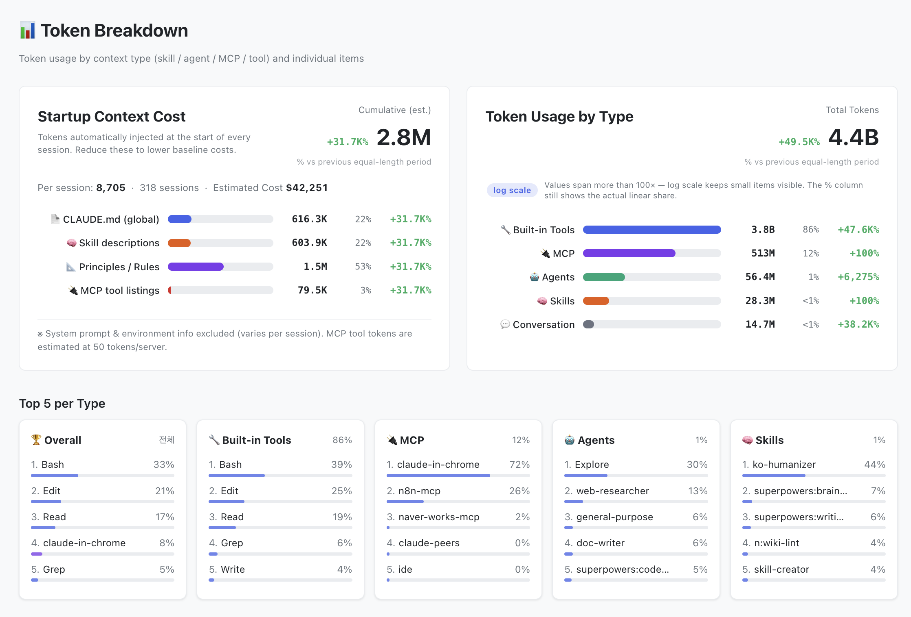
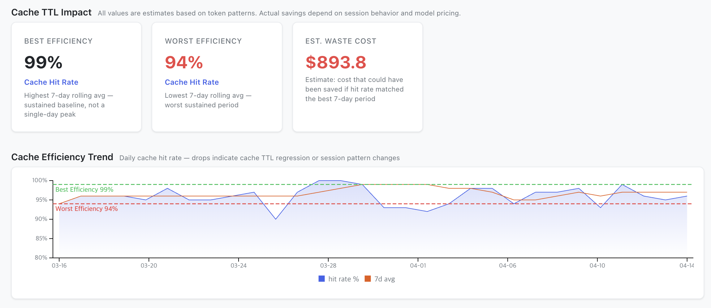

# 👋 oh-my-hi (Oh My Harness Insights)


> **Oh, so that's what Claude's been doing!** — A visual dashboard for your Claude Code harness.

Parses your entire Claude Code configuration and usage data, stores results in a local SQLite database, and serves an interactive dashboard via a local HTTP server.


## What it shows

- **Harness overview** — skills, agents, plugins, hooks, memory, MCP servers, rules, principles, commands, teams, plans
- **Context budget** — estimated token distribution between visible and invisible contexts (startup, tools, user messages)
- **Token analytics** — usage by model, daily trends, cache efficiency, prompt statistics, response latency
- **Token Breakdown** — per-item token attribution by context type (skill / agent / MCP / built-in tool). Shows startup context cost estimate (CLAUDE.md, skill descriptions, principles, MCP tool listings) multiplied by session count, plus a Top 5 per type and an expandable drill-down by type
- **Cache TTL Impact** — detects cost waste from short cache TTL. Shows best/worst 7-day rolling efficiency, estimated waste cost, and a daily hit-rate trend chart with reference lines
- **Month-end cost projection** — trailing 7-day average extrapolated to month end, compared against your monthly budget
- **Skill & agent efficiency** — per-item call count, avg tokens/call, total cost, and category cost share. Sidebar marks the top 3 cost contributors with a 🔥 badge so optimization targets are obvious
- **Context Window Explorer** — replay any past session turn-by-turn to see exactly how the context window filled up
- **Activity heatmaps** — daily usage patterns across skills, agents, and commands
- **Task categories** — auto-classified token usage by work type (code editing, docs, planning, etc.)
- **Multi-workspace** — switch between global and per-project scopes


### Token Breakdown

Breaks down token usage by context type and individual item. Shows which skills, agents, MCP servers, and built-in tools are consuming the most tokens — and how much of that cost comes from startup context that loads on every session.



**Startup context cost** estimates the cumulative token cost of items that load automatically before every session (CLAUDE.md, skill descriptions, principles, MCP tool listings). Multiplied by session count for the selected period, it gives you a concrete number to act on — trim a large CLAUDE.md or remove unused skills to reduce your baseline cost per session.

### Cache TTL Impact

Tracks how much the [cache TTL regression](https://github.com/anthropics/claude-code/issues/46829) (5 min vs 1 hr) may be costing you. Compares 7-day rolling cache hit rates to estimate excess re-creation cost — drops in the trend chart indicate periods when caches expired before being reused.



### Context Window Explorer

Pick a real session from your Claude Code history and replay it turn-by-turn. The explorer breaks down every API turn into its contribution to the context window — system prompt, CLAUDE.md, memory, skill descriptions, MCP tools, user prompts, model responses, tool calls — so you can see exactly where your tokens went and when `/compact` kicked in.


You can also view a guided example session to walk through the mechanics before loading your own:


## Installation

#### From the Command Line

```bash
claude plugin marketplace add netil/oh-my-hi
claude plugin install oh-my-hi
```

#### Claude Code (in-session)

```bash
/plugin marketplace add netil/oh-my-hi
/plugin install oh-my-hi@oh-my-hi
```

## Usage

Run in Claude Code:

```
/omh
```

This will parse your harness data, build the dashboard, and open it in your browser.

### Parameters

| Command | Description |
|---------|-------------|
| `/omh` | Full build — parse data, build web-ui, open in browser |
| `/omh --data-only` | Lightweight data collection (skip dashboard build) |
| `/omh --enable-auto` | Auto-rebuild on session end (registers Stop hook) |
| `/omh --disable-auto` | Disable auto-rebuild |
| `/omh --update` | Check and install latest version |
| `/omh --status` | Check auto-rebuild status |
| `/omh <path>` | Build with specific project paths only |

### Standalone (without Claude Code)

oh-my-hi is also a plain CLI — it does not require Claude Code to run:

```bash
npx --yes oh-my-hi          # one-off
npm install -g oh-my-hi     # then: oh-my-hi  (or: omh)
```

All flags above work the same (`oh-my-hi --data-only`, `oh-my-hi --help`, …).

### Multi-tool: Codex

oh-my-hi discovers data by config directory, so it shows **Claude Code and
[Codex](https://developers.openai.com/codex) side by side** — pick a tool from
the scope selector to see its tokens, cost, sessions, skills, memory, and MCP.

- Claude Code data comes from `CLAUDE_CONFIG_DIR` (default `~/.claude`).
- Codex data comes from `CODEX_HOME` (default `~/.codex`). Set it if your Codex
  config lives elsewhere:

  ```bash
  CODEX_HOME=/path/to/codex-config npx oh-my-hi
  ```

A provider whose config dir is absent is skipped, so a Claude-only (or
Codex-only) machine just works. Codex token accounting (cached-input subset,
reasoning tokens, no cache-creation) and GPT-5.x / Codex pricing are handled
automatically.

**Launching from Codex** — Codex has no plugin system, so run the CLI directly,
or install the ready-made prompt at [`codex/omh-prompt.md`](codex/omh-prompt.md):

```bash
cp codex/omh-prompt.md "${CODEX_HOME:-$HOME/.codex}/prompts/omh.md"   # then use /omh in Codex
```

### Auto-refresh

Enable automatic data refresh so the dashboard stays up to date:

```
/omh --enable-auto
```

This registers a Stop hook that collects data whenever a Claude Code session ends. `data.json` and SQLite are updated incrementally — just refresh the browser tab to see the latest data.

### Update

```
/omh --update
```

Checks for new versions and updates the plugin. An update check also runs automatically once per day when using `/omh`.

## Guide

See **[GUIDE.md](GUIDE.md)** for a detailed walkthrough of each dashboard section — overview, token analytics, cost estimation, structure view, category pages, and more.

## How it works

1. **Parse** — Reads your Claude Code config directory for skills, agents, plugins, hooks, memory, MCP servers, rules, principles, commands, teams, plans, and usage transcripts
2. **Analyze** — Extracts token usage, prompt stats, response latency, activity patterns from `.jsonl` transcripts
3. **Classify** — Auto-categorizes token usage into work types (code editing, docs, planning, etc.) based on skill/agent descriptions. Saves to `task-categories.json` for user customization
4. **Store** — Writes `data.json` (full data) and syncs token entries to `oh-my-hi.sqlite` for fast API queries
5. **Serve** — Starts a local HTTP server (`serve.mjs`, port 7942) with `/api/meta` and `/api/usage` endpoints. Server is reused across builds via a lock file
6. **Open** — On macOS, reuses an existing browser tab if found (AppleScript). On Windows/Linux, opens a new tab

## i18n

- **English**: Built-in default
- **Other languages**: A template locale file is auto-generated on first build. Translate it and rebuild

## Privacy

All data stays on your machine. `oh-my-hi` reads only local Claude Code config files and transcripts — nothing is sent to external servers. The dashboard is served by a local HTTP server on localhost; all API calls go to `127.0.0.1` only. Your usage data, token statistics, and configuration details never leave your local environment.

## Browser support

The dashboard is served locally via `http://localhost:7942` (or next available port). The server starts automatically on first `/omh` run and stays running between builds.

On macOS, subsequent builds will refresh the existing browser tab instead of opening a new one (Chrome and Safari supported).

## License

[MIT](LICENSE)
